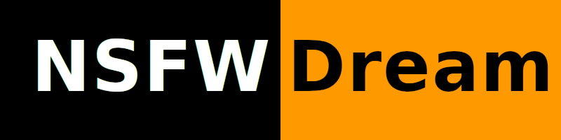
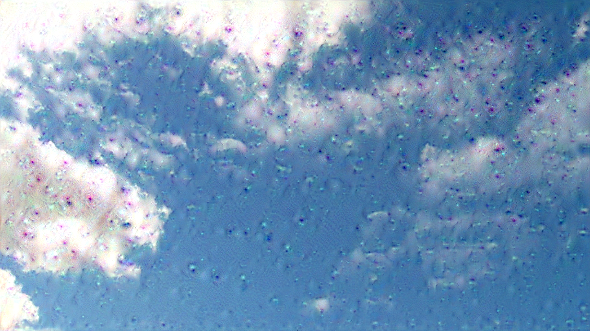
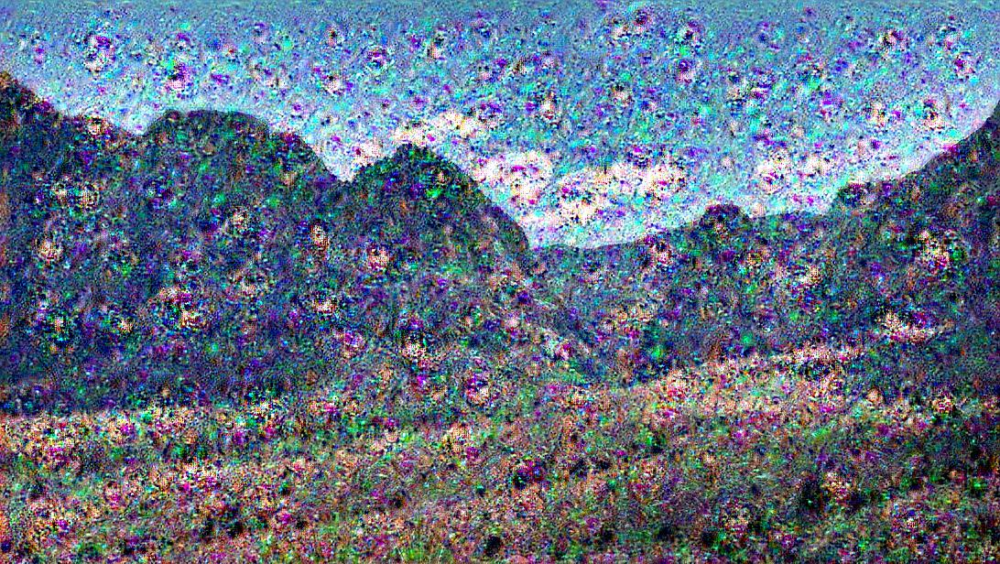

# nsfw-dream

A PyTorch implementation of DeepDream.
Train on an NSFW dataset, so it can generate some things look like penis, vulva, breasts and so on.

## Usage
1. download pretrained model from [releases](https://github.com/fruit-in/nsfw-dream/releases)
2. run jupyter notebook
3. run `dream.ipynb`

## Examples
 
 
 
