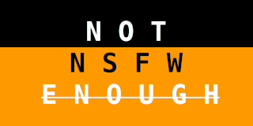

# nsfw-dream

A PyTorch implementation of DeepDream

## Usage
1. download dataset from [EBazarov/nsfw_data_source_urls](https://github.com/EBazarov/nsfw_data_source_urls)
2. run jupyter notebook
3. run `train.ipynb` or download pretrained model from [releases](https://github.com/fruit-in/nsfw-dream/releases)
4. run `dream.ipynb`
